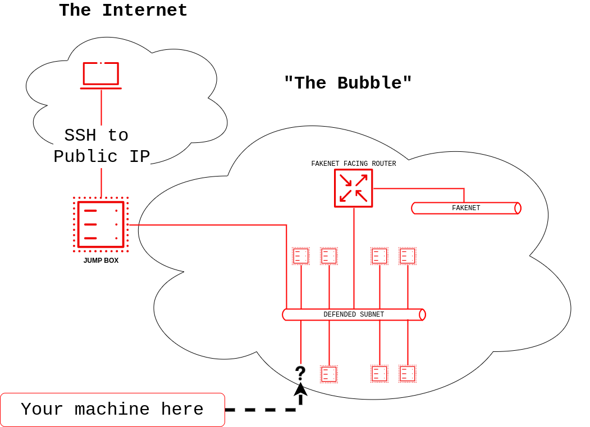

# Collaborative Cyber Range Workshop
The goal of this workshop is to use an established CI/CD pipeline via Github Actions to add your virtual machine to a network of already running virtual machines.

At a high level, it looks like this:
1. Fork this repository
2. Edit `testrange/terraform.tfvars` and add your system to the list of vms.
3. Submit a pull request to this repository.  When it is accepted and merged, the CI/CD pipeline will trigger and you should be able to SSH into your machine when it completes.

